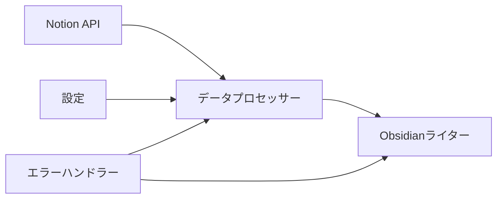

# 設計書

## 概要

Notion-Obsidian同期システムは、NotionデータベースからObsidianボルトへの一方向同期を提供するPythonベースのアプリケーションです。このシステムは、NotionページをYAMLフロントマターを含むMarkdownファイルに変換し、コンテンツとプロパティの両方を保持しながら、競合のない動作を保証します。

## アーキテクチャ

システムは3つの主要段階を持つシンプルなパイプラインアーキテクチャに従います：



### コアコンポーネント

1. **Notionクライアント**: NotionとのAPI通信を処理
2. **データプロセッサー**: NotionデータをMarkdown形式に変換
3. **ファイルマネージャー**: Obsidianボルトのファイル操作を管理
4. **設定マネージャー**: 設定と認証情報を処理
5. **同期オーケストレーター**: 全体の同期プロセスを調整

## コンポーネントとインターフェース

### NotionClient
```python
class NotionClient:
    def __init__(self, api_token: str, database_id: str)
    def get_database_pages(self) -> List[NotionPage]
    def get_page_content(self, page_id: str) -> NotionPageContent
```

### DataProcessor
```python
class DataProcessor:
    def convert_page_to_markdown(self, page: NotionPage) -> MarkdownFile
    def extract_properties(self, page: NotionPage) -> Dict[str, Any]
    def convert_blocks_to_markdown(self, blocks: List[NotionBlock]) -> str
```

### FileManager
```python
class FileManager:
    def __init__(self, vault_path: str)
    def write_markdown_file(self, filename: str, content: str) -> bool
    def ensure_directory_exists(self, path: str) -> None
    def get_safe_filename(self, title: str) -> str
```

### SyncOrchestrator
```python
class SyncOrchestrator:
    def __init__(self, config: SyncConfig)
    def sync_all_pages(self) -> SyncResult
    def sync_single_page(self, page_id: str) -> bool
```

## データモデル

### 設定モデル
```python
@dataclass
class SyncConfig:
    notion_api_token: str
    notion_database_id: str
    obsidian_vault_path: str
    file_naming_pattern: str = "{title}"
    include_properties: bool = True
    overwrite_existing: bool = True
```

### Notionデータモデル
```python
@dataclass
class NotionPage:
    id: str
    title: str
    properties: Dict[str, Any]
    created_time: datetime
    last_edited_time: datetime

@dataclass
class NotionPageContent:
    page: NotionPage
    blocks: List[NotionBlock]
```

### 出力モデル
```python
@dataclass
class MarkdownFile:
    filename: str
    frontmatter: Dict[str, Any]
    content: str
    
    def to_string(self) -> str:
        # YAMLフロントマターとMarkdownコンテンツを結合
```

## エラーハンドリング

### エラーカテゴリ
1. **APIエラー**: Notion APIレート制限、認証失敗
2. **ファイルシステムエラー**: 権限問題、ディスク容量、無効なパス
3. **データ変換エラー**: サポートされていないNotionブロックタイプ、エンコーディング問題
4. **設定エラー**: 認証情報の欠如、無効なボルトパス

### エラーハンドリング戦略
- **グレースフル・デグラデーション**: 個別ページが失敗した場合でも他のページの処理を継続
- **リトライロジック**: APIレート制限に対する指数バックオフの実装
- **詳細ログ**: 適切な重要度レベルでの全操作のログ記録
- **ユーザーフレンドリーメッセージ**: 明確なエラー説明と推奨アクションの提供

### 競合防止
- **アトミックファイル操作**: 一時ファイルとアトミック移動の使用
- **ファイルロック**: 同一ファイルへの同時アクセスを防止
- **検証**: 操作前後でのファイル整合性の確認

## テスト戦略

### ユニットテスト
- 各コンポーネントを独立してテスト
- 外部依存関係（Notion API、ファイルシステム）をモック化
- エラー条件とエッジケースをテスト
- データ変換の精度を検証

### 統合テスト
- エンドツーエンドの同期ワークフローをテスト
- 実際のNotion API（テストデータベース使用）でテスト
- ファイルシステム操作を検証
- 設定の読み込みと検証をテスト

### テストデータ
- 様々なコンテンツタイプのサンプルNotionページを作成
- 異なるプロパティ設定のページを含める
- タイトルとコンテンツの特殊文字をテスト
- 大きなページと多数のページをテスト

### パフォーマンス考慮事項
- **レート制限**: Notion APIレート制限（毎秒3リクエスト）の遵守
- **バッチ処理**: 設定可能なバッチサイズでページを処理
- **メモリ管理**: すべてをメモリに読み込むのではなく大きなコンテンツをストリーミング
- **キャッシュ**: 不要なAPI呼び出しを避けるためページメタデータをキャッシュ

## セキュリティ考慮事項

### APIトークン管理
- 環境変数または安全な設定ファイルにトークンを保存
- エラーメッセージでAPIトークンをログ出力または露出させない
- システム再起動なしでのトークンローテーションをサポート

### ファイルシステムセキュリティ
- ディレクトリトラバーサルを防ぐためボルトパスを検証
- 作成されるファイルに適切なファイル権限を設定
- 悪意のあるファイル作成を防ぐためファイル名をサニタイズ

## デプロイメントと設定

### 設定ファイル形式（YAML）
```yaml
notion:
  api_token: ${NOTION_API_TOKEN}
  database_id: "your-database-id"

obsidian:
  vault_path: "/path/to/obsidian/vault"
  subfolder: "notion-sync"  # オプション

sync:
  file_naming: "{title}"
  include_properties: true
  overwrite_existing: true
  batch_size: 10
```

### 環境変数
- `NOTION_API_TOKEN`: Notion統合トークン
- `OBSIDIAN_VAULT_PATH`: Obsidianボルトへのパス（オプション、設定ファイルで指定可能）

### 実行モード
1. **一回限りの同期**: 一度実行して終了
2. **スケジュール同期**: cronまたはタスクスケジューラー経由で実行
3. **監視モード**: 変更を監視（将来の拡張機能）